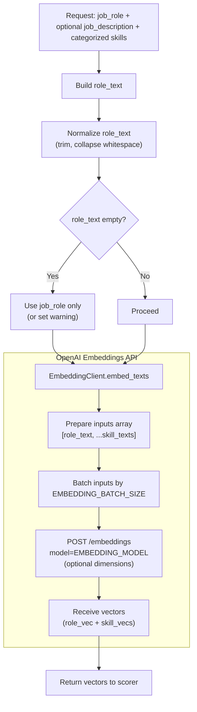

# Embedding Overview

This document provides an overview of the embedding-based skill selection method.
The embedding method is currently still under development, so some information may be subject to change.

## What is the embedding-based method?

`METHOD=embeddings` ranks input skills (per category) by cosine similarity between:

* **role text** = `job_role` + optional `job_description`
* **skill text** = each skill string

Using an OpenAI embedding model like `text-embedding-3-small` or `text-embedding-3-large`. 

## Embedding workflow

### High-level flow

### Scoring flow (draft)

```mermaid
flowchart TD
  A[select-skills endpoint] --> B[Validate request schema<br>3 categories + non-empty skill strings]
  B --> C["Pick scorer via METHOD<br>baseline &#124; embeddings &#124; hybrid"]

  C --> D{METHOD == embeddings?}
  D -- No --> Z["Use other scorer<br>(baseline/hybrid)"] --> Y[Return Top N per category]

  D -- Yes --> E["For each category:<br>Technology / Programming / Concepts"]
  E --> F[Extract skill list for category]
  F --> G{skills empty?}
  G -- Yes --> H[Return empty list for category] --> E
  G -- No --> I["Normalize skill strings<br>(lowercase, trim, map synonyms if any)"]

  I --> J["Lookup skill embeddings in cache<br>key=(model, dimensions, normalized_skill)"]
  J --> K{All skill embeddings cached?}
  K -- Yes --> L[Use cached vectors]
  K -- No --> M["Embed missing skills via EmbeddingClient<br>(batched)"]
  M --> N[Store new skill vectors in cache]
  N --> L

  L --> O["Embed role_text once<br>(or cache per-request)"]
  O --> P["Compute cosine similarity<br>role_vec vs each skill_vec"]
  P --> Q["Sort by:<br>1) similarity desc<br>2) skill name asc (tie-break)"]
  Q --> R[Select Top N for category]
  R --> E

  E --> S{Any embedding errors?}
  S -- No --> T["Assemble response<br>selected_skills per category"]
  S -- Yes --> U["Fallback to baseline<br>+ dev_mode warning"]
  U --> T

  T --> V[Return response]
```

- `app/services/embedding_client.py` handles communication with the OpenAI API, including batching and optional dimensionality reduction, and the main embedding logic.
- `app/scoring/embeddings.py` will implement the cosine similarity scoring and ranking logic, using the embedding client to get vectors.