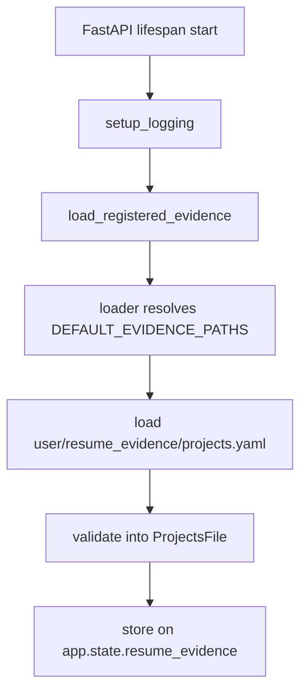
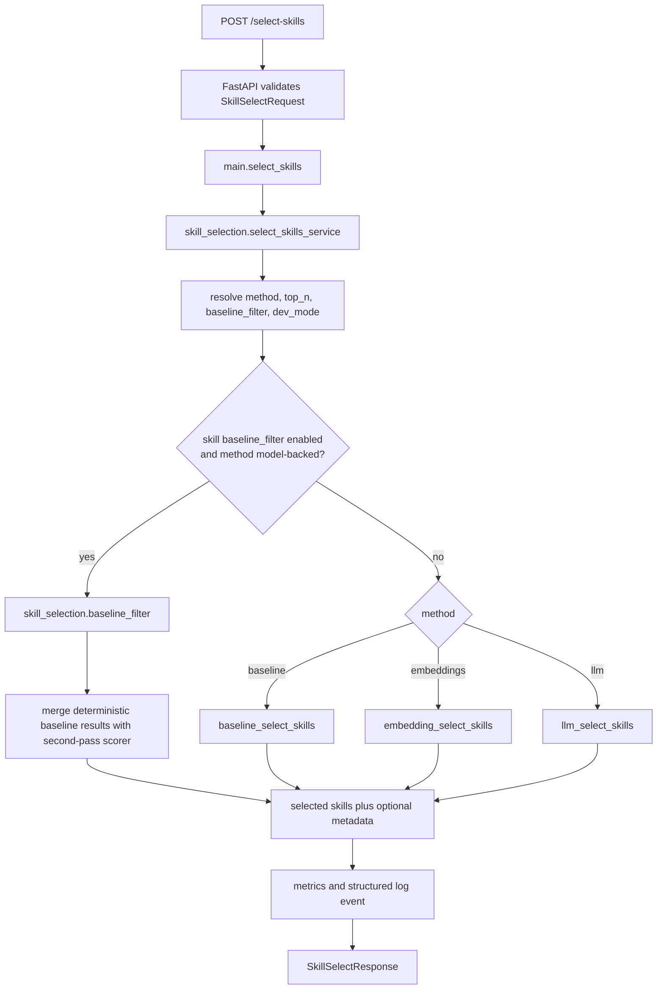
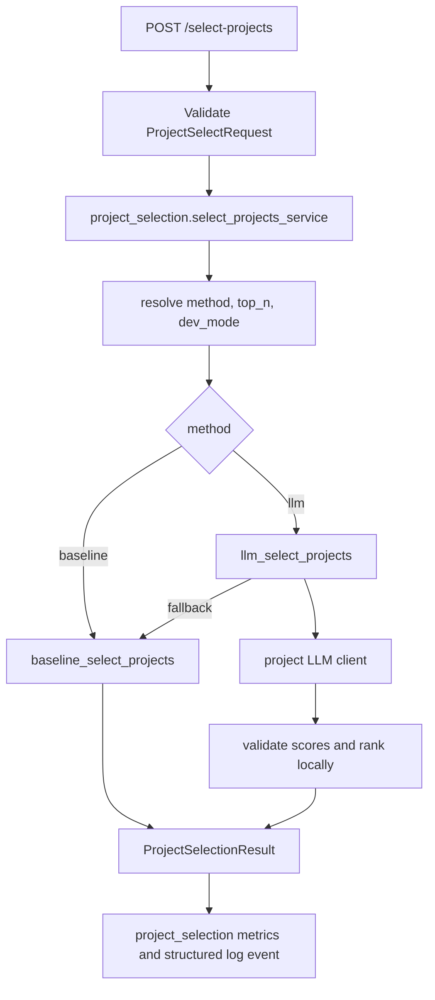

# Architecture Overview

This document maps the current `app/` structure so agents can move quickly across the resume-engine subsystems: skill selection, project selection, and resume evidence.

## 1) High-Level Structure (`app/`)

- `app/main.py`
  - FastAPI app composition, lifespan setup, HTTP routes, startup evidence loading
- `app/config.py`
  - scoped runtime settings loaded from environment for skill selection and project selection
- `app/metrics.py`
  - in-memory aggregate and per-subsystem request, error, latency, and token counters
- `app/logging_config.py`
  - structured logging setup
- `app/skill_selection/`
  - skill-selection models, service wrapper, baseline filter, model clients, scoring logic, role profiles, synonym map, and embedding caches
- `app/project_selection/`
  - project-selection models, API service wrapper, selector, baseline/LLM rankers, and project LLM client
- `app/resume_evidence/`
  - strict evidence schemas, registry loading, staged CRUD/session logic, and CLI
- `app/skill_selection/selector.py`
  - API orchestration for method selection, metrics, logging, and response shaping
- `app/models.py`, `app/scoring/*`, `app/services/*`
  - compatibility shims for legacy import paths; new code should use subsystem paths

## 2) Module Dependency Map

```text
app.main
  -> app.config
  -> app.metrics
  -> app.logging_config
  -> app.skill_selection
  -> app.project_selection
  -> app.resume_evidence

app.skill_selection.selector
  -> app.config
  -> app.metrics
  -> app.skill_selection.models
  -> app.skill_selection.baseline_filter
  -> app.skill_selection.scoring

app.skill_selection.scoring.baseline
  -> app.skill_selection.scoring.synonyms
  -> app.skill_selection.scoring.role_profiles
  -> app.skill_selection.data

app.skill_selection.scoring.embeddings
  -> app.skill_selection.embedding_client
  -> app.skill_selection.embedding_cache

app.skill_selection.scoring.llm
  -> app.skill_selection.scoring.baseline
  -> app.skill_selection.llm_client

app.project_selection.service
  -> app.metrics
  -> app.project_selection.selector

app.project_selection
  -> app.resume_evidence.models
  -> app.skill_selection.scoring.baseline
  -> app.project_selection.llm_client

app.resume_evidence
  -> app.resume_evidence.loader
  -> app.resume_evidence.models
  -> app.resume_evidence.session

app.resume_evidence.loader
  -> app.resume_evidence.models
  -> user/resume_evidence/projects.yaml

app.resume_evidence.session
  -> app.resume_evidence.loader
  -> app.resume_evidence.models

legacy compatibility shims
  -> app.skill_selection.*
  -> app.project_selection.llm_client
```

## 3) Startup And Runtime Flow

### FastAPI startup



- Startup currently loads the registered evidence set into `app.state.resume_evidence`.
- Today that registry contains only the `projects` schema.
- This is the first implemented runtime evidence hook for the broader resume engine direction.

### Skill-selection request flow



### Project-selection request flow



## 4) Current Skill-Selection Logic

### Baseline scorer

`baseline_select_skills(...)` processes each category independently using shared rules:

1. Detect role family from `job_role`.
2. Normalize skills using the synonym map.
3. Load and normalize role-profile keywords.
4. Score exact or token-boundary matches above weaker partial matches.
5. Sort deterministically with stable tie-breaking.
6. Return selected skills, plus dev metadata when enabled.

### Model-backed methods

- `embeddings`
  - scores via embedding similarity and keeps deterministic response ordering locally
- `llm`
  - scores through the Responses API, validates output locally, and falls back to baseline when needed
- `baseline_filter`
  - lets deterministic matches bypass the second pass so model-backed methods only score the remainder

## 5) Project Selection

The repo now includes project selection as a first-class subsystem. It ranks explicit project candidates for a job target and does not generate resume content.

Implemented now:

- `POST /select-projects` accepts explicit project candidates plus job title/description context.
- `select_projects(...)` accepts explicit project candidates plus job title/description context.
- `method="baseline"` combines existing baseline skill selection over each project’s skills with deterministic summary/job text overlap.
- `method="llm"` uses a dedicated project LLM client, validates project-id scores locally, ranks locally, and falls back to baseline when the LLM path fails.
- Runtime defaults are scoped with `PROJ_METHOD` and `PROJ_TOP_N`.
- Baseline filtering is currently skill-selection-only; project selection has no `PROJ_BASELINE_FILTER` setting or two-pass baseline-filter algorithm.
- Results contain project IDs and numeric scores, not project summaries, highlights, links, or synthesized claims.

## 6) Currently Implemented Evidence Layer

This repo is no longer only a skill-selection codebase. It now contains an implemented first evidence milestone for grounded resume generation.

### Implemented now

- canonical evidence root: `user/resume_evidence/`
- implemented schema: `user/resume_evidence/projects.yaml`
- runtime model: `ProjectsFile` containing validated `ProjectRecord` items
- startup loading: `load_registered_evidence()` in `app.main`
- local CRUD/session workflow: `ProjectsEvidenceSession`
- interactive CLI: `python -m app.resume_evidence.cli`

### `projects.yaml` contract

The currently implemented root shape is:

```yaml
schema_version: 1
projects:
  - id: project-id
    name: Project Name
    summary: Grounded summary
    highlights:
      - Evidence-backed highlight
    active: true
    skills:
      technology: []
      programming: []
      concepts: []
    links: []
```

Validation guarantees:

- extra fields are rejected
- `schema_version` is locked to `1`
- `highlights` must be non-empty
- skill buckets must match the shared `technology` / `programming` / `concepts` taxonomy
- duplicate project IDs are rejected

### CLI/session behavior

`ProjectsEvidenceSession` works on a staged in-memory copy:

- create, edit, and delete operations validate before mutating staged state
- `dirty` tracks whether staged data differs from the baseline file
- `apply()` writes atomically to disk
- `reload()` discards staged changes and reloads from disk
- project IDs are generated from project names for new records and remain stable across renames

## 7) Future Resume Pipeline

The evidence layer and explicit-candidate project selector above are implemented. The broader resume-generation pipeline below is still planned:

```text
user/resume_evidence/*.yaml
  -> deterministic load/validate/index
  -> synthesis/extraction
  -> structured fill data with provenance
  -> deterministic assembly
  -> generated resume artifact
```

Planned but not yet implemented:

- additional evidence files
  - `user/resume_evidence/profile.yaml`
  - `user/resume_evidence/experience.yaml`
  - `user/resume_evidence/skills.yaml`
- resume format definitions under `app/data/resume_formats/`
- synthesis/extraction logic
- deterministic full-resume assembly
- adapters that rank projects directly from loaded `app.state.resume_evidence`

Skill selection is expected to remain one prioritization signal for the future Skills section, not the whole source of truth for resume generation.

## 8) Data And State

- Configuration state
  - loaded from `.env` and environment variables through `app/config.py`
  - selection settings are scoped as `SKILL_*` and `PROJ_*`; legacy generic selection env vars are ignored
- Knowledge state
  - role profiles from `app/skill_selection/data/role_profiles/*.yaml`
  - synonym normalization from `app/skill_selection/data/synonym_to_normalized.json`
- Mutable runtime state
  - `metrics` singleton in `app/metrics.py`
  - `app.state.resume_evidence` loaded during FastAPI startup
- Disk-backed derived state
  - embedding caches under `app/skill_selection/data/embeddings/{model}/`
- User-authored source-of-truth state
  - `user/resume_evidence/projects.yaml`

## 9) Routes And Interfaces

- `GET /health`
  - returns liveness plus effective config values
- `GET /metrics-lite`
  - returns aggregate plus `skill_selection` and `project_selection` request, error, latency, token, and method-usage metrics
- `POST /select-skills`
  - current public business API for skill ranking
- `POST /select-projects`
  - public project-ranking API for explicit project candidates
- `python -m app.resume_evidence.cli`
  - current local interface for project evidence CRUD/session management

## 10) Agent Quick-Read Sequence

1. `AGENTS.md`
2. `CLAUDE.md`
3. `docs/agent-context-index.md`
4. `docs/architecture-overview.md`
5. `README.md`
6. `app/main.py`
7. `app/skill_selection/selector.py`
8. `app/project_selection/service.py`
9. `app/project_selection/selector.py`
10. `app/resume_evidence/loader.py`
11. `app/resume_evidence/session.py`
12. `docs/branch-03-grounded-resume-generation.md`
13. `docs/decisions/003-grounded-resume-evidence-pipeline.md`
14. `docs/decisions/004-user-resume-evidence-root-and-projects-milestone.md`
15. `docs/decisions/005-subsystem-package-organization.md`
