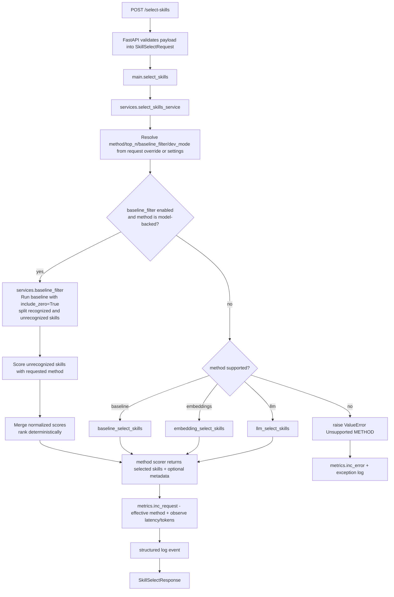

# Architecture Overview

This document maps `app/` relationships and runtime logic flow so agents can navigate the codebase quickly.

## 1) High-Level Structure (`app/`)

- `app/main.py`: FastAPI app composition, lifespan setup, HTTP routes.
- `app/models.py`: Request/response contracts (`SkillSelectRequest`, `SkillSelectResponse`).
- `app/config.py`: Runtime settings (`METHOD`, `TOP_N`, `BASELINE_FILTER`, `DEV_MODE`, `LOG_LEVEL`) from env.
- `app/services/skill_selector.py`: Service orchestration for method selection, metrics, logging.
- `app/services/baseline_filter.py`: Optional baseline-filter orchestration for model-backed scorers.
- `app/services/llm_client.py`: OpenAI Responses API wrapper for LLM scoring.
- `app/scoring/baseline.py`: Deterministic baseline ranking pipeline.
- `app/scoring/llm.py`: LLM scoring validation, deterministic ranking, and baseline fallback.
- `app/scoring/role_profiles.py`: Role profile loading and role-family detection.
- `app/scoring/synonyms.py`: Skill normalization alias map.
- `app/metrics.py`: In-memory thread-safe counters/latency aggregation.
- `app/logging_config.py`: JSON logger formatter and root logger setup.
- `app/data/role_profiles/*.yaml`: Role profile keyword knowledge base.

## 2) Module Dependency Map

```text
app.main
  -> app.models
  -> app.config
  -> app.services.skill_selector
  -> app.metrics
  -> app.logging_config

app.services.skill_selector
  -> app.config
  -> app.metrics
  -> app.models
  -> app.services.baseline_filter
  -> app.scoring.baseline
  -> app.scoring.embeddings
  -> app.scoring.llm

app.services.baseline_filter
  -> app.models
  -> app.scoring.baseline
  -> app.scoring.embeddings
  -> app.scoring.llm

app.scoring.baseline
  -> app.scoring.synonyms
  -> app.scoring.role_profiles (detect_role_family + ROLE_PROFILES)

app.scoring.llm
  -> app.scoring.baseline (fallback + normalization)
  -> app.services.llm_client

app.services.llm_client
  -> OpenAI Responses API

app.scoring.role_profiles
  -> app/data/role_profiles/*.yaml
```

## 3) End-to-End Request Flow



## 4) Baseline Scoring Logic Flow

`baseline_select_skills(...)` processes each category independently with shared rules:

1. Role family resolution:
- `detect_role_family(job_role)` converts role string to a profile key candidate.

2. Skill normalization:
- `normalize_skill(skill)` lowercases/trims and canonicalizes aliases via `SYNONYM_TO_NORMALIZED`.

3. Keyword matching:
- Loads category keywords from `ROLE_PROFILES[role_family]` (fallback to `general`).
- If profile declares `inherits`, inherited keywords are merged for that category.

4. Score assignment:
- Exact canonical keyword match => `3.0`
- Partial containment match => `1.0`
- Otherwise => `0.0` (excluded unless `include_zero=True`)

5. Deterministic ranking:
- Sort key: `(-score, original_skill_string)`
- Stable top selection: first `top_n` skills

6. Response shaping:
- Returns selected skills per category.
- Returns per-skill details only when `dev_mode=True`.

## 5) Data Flow and State

- Configuration state:
  - Source: `.env` + defaults in `app/config.py`.
  - Read at runtime for fallback behavior and the optional baseline pre-filter.

- Knowledge state:
  - Role profiles loaded from YAML at module import time in `role_profiles.py`.
  - Synonym map loaded from static dict in `synonyms.py`.

- Runtime mutable state:
  - `metrics` singleton in `app/metrics.py` (protected by lock), including request counts, effective method usage, latency, errors, and total model tokens.

- External model state:
  - Embeddings use `app/services/embedding_client.py` and disk cache files under `app/data/embeddings/{model}/`.
  - LLM scoring uses `app/services/llm_client.py`; final validation and ranking happen locally in `app/scoring/llm.py`.

## 6) Route Responsibilities

- `GET /health`:
  - Liveness + effective config surface (`method`, `top_n`, `dev_mode`).

- `GET /metrics-lite`:
  - In-memory counters and average latency snapshot.

- `POST /select-skills`:
  - Main business route; delegates to service layer and converts `ValueError` to HTTP 400.

## 7) Extension Points (Safe Order)

1. Add/adjust role profile YAML keywords in `app/data/role_profiles/`.
2. Add/adjust synonyms in `app/scoring/synonyms.py`.
3. Extend service method dispatch in `app/services/skill_selector.py` for new methods.
4. Keep baseline path intact as deterministic fallback.

## 8) Agent Quick-Read Sequence

1. `AGENTS.md` (repo constraints and logging requirements).
2. `CLAUDE.md` (service-specific engineering rules).
3. `docs/architecture-overview.md` (this file; relationships + flow).
4. `app/main.py` -> `app/services/skill_selector.py` -> `app/scoring/baseline.py`.
5. `app/scoring/role_profiles.py` + `app/data/role_profiles/*.yaml`.

For embedding-based method, also review:
- `docs/Embedding.md` (method overview).
- `app/services/embedding_client.py` -> `app/scoring/embeddings.py` (once implemented).

For LLM-based method, also review:
- `docs/branch-02-llm-skill-selection.md`.
- `app/services/llm_client.py` -> `app/scoring/llm.py`.
