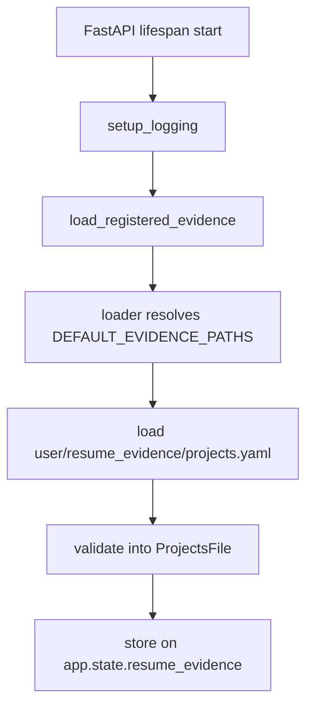
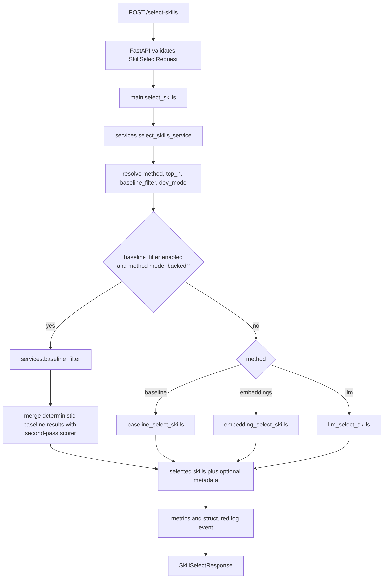

# Architecture Overview

This document maps the current `app/` structure so agents can move quickly between the shipped skill-selection service and the implemented first milestone of the grounded resume-evidence pipeline.

## 1) High-Level Structure (`app/`)

- `app/main.py`
  - FastAPI app composition, lifespan setup, HTTP routes, startup evidence loading
- `app/models.py`
  - request/response contracts for `/select-skills`
- `app/config.py`
  - runtime settings loaded from environment
- `app/metrics.py`
  - in-memory request, error, latency, and token counters
- `app/logging_config.py`
  - structured logging setup
- `app/services/skill_selector.py`
  - API orchestration for method selection, metrics, logging, and response shaping
- `app/services/baseline_filter.py`
  - optional deterministic first-pass routing before model-backed methods
- `app/services/embedding_client.py`
  - OpenAI embeddings client and cache integration
- `app/services/llm_client.py`
  - OpenAI Responses API wrapper for LLM scoring
- `app/scoring/baseline.py`
  - deterministic baseline ranking pipeline
- `app/scoring/embeddings.py`
  - embedding-based ranking with deterministic output shaping
- `app/scoring/llm.py`
  - LLM scoring validation, deterministic ranking, and baseline fallback
- `app/scoring/role_profiles.py`
  - role profile loading and role-family detection
- `app/scoring/synonyms.py`
  - skill normalization alias map
- `app/resume_evidence/models.py`
  - strict Pydantic schema for `projects.yaml`
- `app/resume_evidence/loader.py`
  - schema registry, default evidence paths, YAML loading helpers
- `app/resume_evidence/session.py`
  - staged project CRUD session with validation and atomic save
- `app/resume_evidence/cli.py`
  - interactive CLI for managing `projects.yaml`
- `app/data/role_profiles/*.yaml`
  - role profile knowledge base
- `user/resume_evidence/projects.yaml`
  - currently implemented user-authored evidence source file

## 2) Module Dependency Map

```text
app.main
  -> app.models
  -> app.config
  -> app.services.skill_selector
  -> app.metrics
  -> app.logging_config
  -> app.resume_evidence

app.services.skill_selector
  -> app.config
  -> app.metrics
  -> app.models
  -> app.services.baseline_filter
  -> app.scoring.baseline
  -> app.scoring.embeddings
  -> app.scoring.llm

app.services.baseline_filter
  -> app.models
  -> app.scoring.baseline
  -> app.scoring.embeddings
  -> app.scoring.llm

app.scoring.baseline
  -> app.scoring.synonyms
  -> app.scoring.role_profiles

app.scoring.embeddings
  -> app.services.embedding_client

app.scoring.llm
  -> app.scoring.baseline
  -> app.services.llm_client

app.resume_evidence
  -> app.resume_evidence.loader
  -> app.resume_evidence.models
  -> app.resume_evidence.session

app.resume_evidence.loader
  -> app.resume_evidence.models
  -> user/resume_evidence/projects.yaml

app.resume_evidence.session
  -> app.resume_evidence.loader
  -> app.resume_evidence.models
```

## 3) Startup And Runtime Flow

### FastAPI startup



- Startup currently loads the registered evidence set into `app.state.resume_evidence`.
- Today that registry contains only the `projects` schema.
- This is the first implemented runtime evidence hook for the broader resume engine direction.

### Skill-selection request flow



## 4) Current Skill-Selection Logic

### Baseline scorer

`baseline_select_skills(...)` processes each category independently using shared rules:

1. Detect role family from `job_role`.
2. Normalize skills using the synonym map.
3. Load and normalize role-profile keywords.
4. Score exact or token-boundary matches above weaker partial matches.
5. Sort deterministically with stable tie-breaking.
6. Return selected skills, plus dev metadata when enabled.

### Model-backed methods

- `embeddings`
  - scores via embedding similarity and keeps deterministic response ordering locally
- `llm`
  - scores through the Responses API, validates output locally, and falls back to baseline when needed
- `baseline_filter`
  - lets deterministic matches bypass the second pass so model-backed methods only score the remainder

## 5) Currently Implemented Evidence Layer

This repo is no longer only a skill-selection codebase. It now contains an implemented first evidence milestone for grounded resume generation.

### Implemented now

- canonical evidence root: `user/resume_evidence/`
- implemented schema: `user/resume_evidence/projects.yaml`
- runtime model: `ProjectsFile` containing validated `ProjectRecord` items
- startup loading: `load_registered_evidence()` in `app.main`
- local CRUD/session workflow: `ProjectsEvidenceSession`
- interactive CLI: `python -m app.resume_evidence.cli`

### `projects.yaml` contract

The currently implemented root shape is:

```yaml
schema_version: 1
projects:
  - id: project-id
    name: Project Name
    summary: Grounded summary
    highlights:
      - Evidence-backed highlight
    active: true
    skills:
      technology: []
      programming: []
      concepts: []
    links: []
```

Validation guarantees:

- extra fields are rejected
- `schema_version` is locked to `1`
- `highlights` must be non-empty
- skill buckets must match the shared `technology` / `programming` / `concepts` taxonomy
- duplicate project IDs are rejected

### CLI/session behavior

`ProjectsEvidenceSession` works on a staged in-memory copy:

- create, edit, and delete operations validate before mutating staged state
- `dirty` tracks whether staged data differs from the baseline file
- `apply()` writes atomically to disk
- `reload()` discards staged changes and reloads from disk
- project IDs are generated from project names for new records and remain stable across renames

## 6) Future Resume Pipeline

The evidence layer above is implemented. The broader resume-generation pipeline below is still planned:

```text
user/resume_evidence/*.yaml
  -> deterministic load/validate/index
  -> synthesis/extraction
  -> structured fill data with provenance
  -> deterministic assembly
  -> generated resume artifact
```

Planned but not yet implemented:

- additional evidence files
  - `user/resume_evidence/profile.yaml`
  - `user/resume_evidence/experience.yaml`
  - `user/resume_evidence/skills.yaml`
- resume format definitions under `app/data/resume_formats/`
- synthesis/extraction logic
- deterministic full-resume assembly

Skill selection is expected to remain one prioritization signal for the future Skills section, not the whole source of truth for resume generation.

## 7) Data And State

- Configuration state
  - loaded from `.env` and environment variables through `app/config.py`
- Knowledge state
  - role profiles from `app/data/role_profiles/*.yaml`
  - synonym normalization from `app/data/synonym_to_normalized.json`
- Mutable runtime state
  - `metrics` singleton in `app/metrics.py`
  - `app.state.resume_evidence` loaded during FastAPI startup
- Disk-backed derived state
  - embedding caches under `app/data/embeddings/{model}/`
- User-authored source-of-truth state
  - `user/resume_evidence/projects.yaml`

## 8) Routes And Interfaces

- `GET /health`
  - returns liveness plus effective config values
- `GET /metrics-lite`
  - returns request, error, latency, token, and method-usage metrics
- `POST /select-skills`
  - current public business API for skill ranking
- `python -m app.resume_evidence.cli`
  - current local interface for project evidence CRUD/session management

## 9) Agent Quick-Read Sequence

1. `AGENTS.md`
2. `CLAUDE.md`
3. `docs/agent-context-index.md`
4. `docs/architecture-overview.md`
5. `README.md`
6. `app/main.py`
7. `app/services/skill_selector.py`
8. `app/resume_evidence/loader.py`
9. `app/resume_evidence/session.py`
10. `docs/branch-03-grounded-resume-generation.md`
11. `docs/decisions/003-grounded-resume-evidence-pipeline.md`
12. `docs/decisions/004-user-resume-evidence-root-and-projects-milestone.md`
