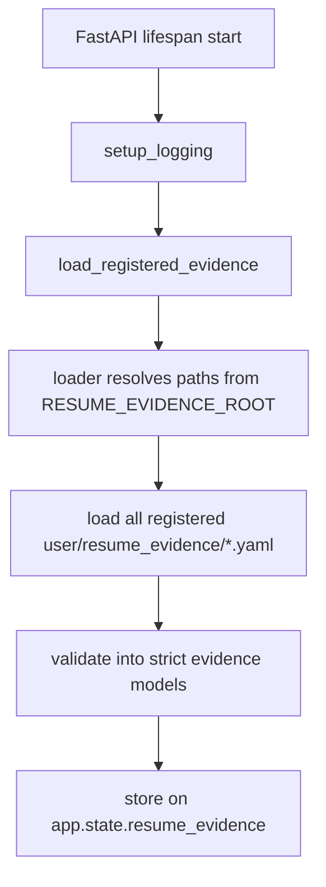
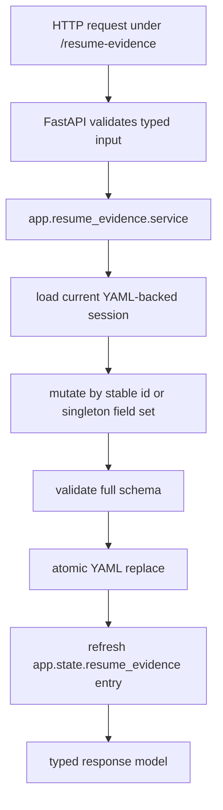
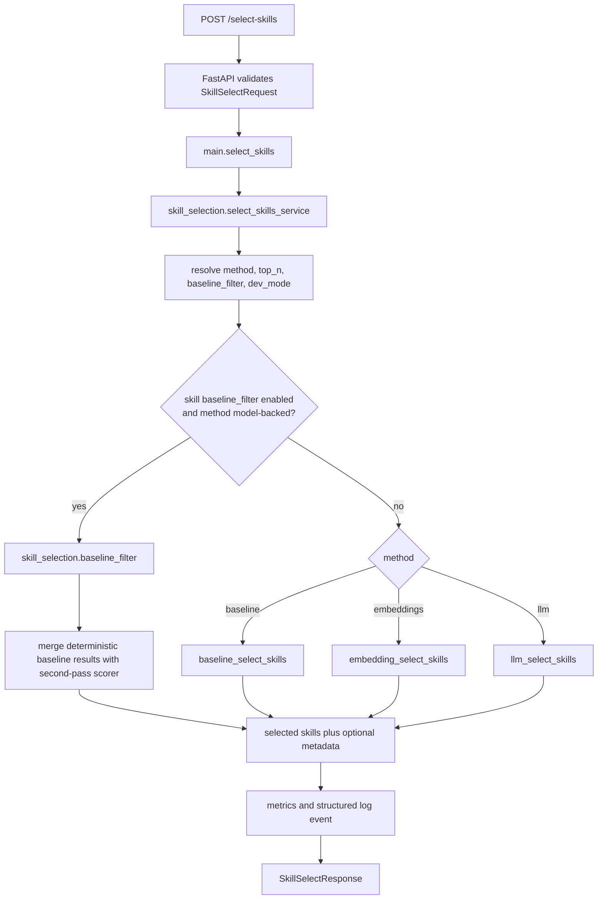
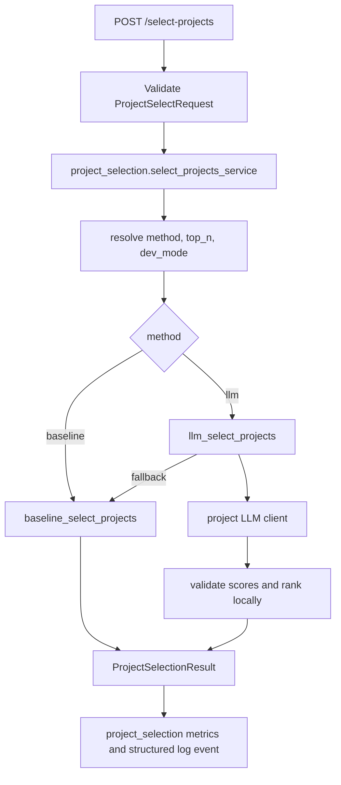
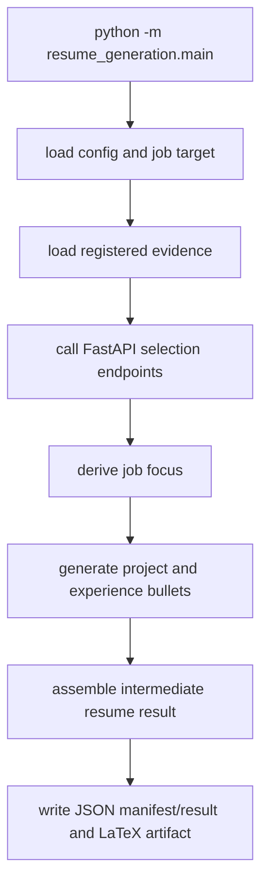

# Architecture Overview

This document maps the current JobForge structure so agents can move quickly across the resume-engine subsystems: FastAPI backend capabilities, grounded resume evidence, local resume-generation orchestration, and the planned service facade.

## 1) High-Level Structure

- `app/main.py`
  - FastAPI app composition, lifespan setup, HTTP routes, startup evidence loading
- `app/config.py`
  - scoped runtime settings loaded from environment for selection, generation, link scanning, and observability
- `app/metrics.py`
  - in-memory aggregate and per-subsystem request, error, latency, and token counters
- `app/logging_config.py`
  - structured logging setup
- `app/skill_selection/`
  - skill-selection models, service wrapper, baseline filter, model clients, scoring logic, role profiles, synonym map, and embedding caches
- `app/project_selection/`
  - project-selection models, API service wrapper, selector, baseline/LLM rankers, and project LLM client
- `app/job_focus_generation/`
  - job-focus derivation models, service wrapper, and LLM client
- `app/bulletpoints_generation/`
  - grounded bullet-point generation models, service wrapper, and LLM client
- `app/link_scanning/`
  - standalone evidence enrichment models, service wrapper, and LLM client
- `app/resume_evidence/`
  - strict evidence schemas, registry loading, ID-oriented service helpers, FastAPI CRUD routes, and staged CRUD/session logic
- `resume_evidence/`
  - legacy compatibility shims plus the local CLI entrypoint
- `resume_generation/`
  - top-level orchestration package that loads evidence, calls backend capabilities over HTTP, caches stages, assembles intermediate resume results, and renders LaTeX artifacts
- `app/skill_selection/selector.py`
  - API orchestration for method selection, metrics, logging, and response shaping
- `app/models.py`, `app/scoring/*`, `app/services/*`
  - compatibility shims for legacy import paths; new code should use subsystem paths

## 2) Module Dependency Map

```text
app.main
  -> app.config
  -> app.metrics
  -> app.logging_config
  -> app.skill_selection
  -> app.project_selection
  -> app.job_focus_generation
  -> app.bulletpoints_generation
  -> app.link_scanning
  -> app.resume_evidence

app.skill_selection.selector
  -> app.config
  -> app.metrics
  -> app.skill_selection.models
  -> app.skill_selection.baseline_filter
  -> app.skill_selection.scoring

app.skill_selection.scoring.baseline
  -> app.skill_selection.scoring.synonyms
  -> app.skill_selection.scoring.role_profiles
  -> app.skill_selection.data

app.skill_selection.scoring.embeddings
  -> app.skill_selection.embedding_client
  -> app.skill_selection.embedding_cache

app.skill_selection.scoring.llm
  -> app.skill_selection.scoring.baseline
  -> app.skill_selection.llm_client

app.project_selection.service
  -> app.metrics
  -> app.project_selection.selector

app.project_selection
  -> app.resume_evidence.models
  -> app.skill_selection.scoring.baseline
  -> app.project_selection.llm_client

app.job_focus_generation
  -> app.metrics
  -> app.job_focus_generation.llm_client

app.bulletpoints_generation
  -> app.metrics
  -> app.resume_evidence.models
  -> app.bulletpoints_generation.llm_client

app.link_scanning
  -> app.metrics
  -> app.resume_evidence.models
  -> app.link_scanning.llm_client

app.resume_evidence
  -> app.resume_evidence.loader
  -> app.resume_evidence.models
  -> app.resume_evidence.session
  -> app.resume_evidence.service
  -> user/resume_evidence/*.yaml

resume_generation
  -> app.resume_evidence
  -> app skill/project/focus/bullet HTTP contracts
  -> user/resume_generation/config.yaml
  -> user/resume_generation/job_target.yaml

app.resume_evidence.loader
  -> app.resume_evidence.models
  -> user/resume_evidence/education.yaml
  -> user/resume_evidence/experience.yaml
  -> user/resume_evidence/projects.yaml
  -> user/resume_evidence/skills.yaml
  -> user/resume_evidence/user.yaml

app.resume_evidence.session
  -> app.resume_evidence.loader
  -> app.resume_evidence.models

legacy compatibility shims
  -> app.skill_selection.*
  -> app.project_selection.llm_client
```

## 3) Startup And Runtime Flow

### FastAPI startup



- Startup currently loads the registered evidence set into `app.state.resume_evidence`.
- Today that registry contains `education`, `experience`, `projects`, `skills`, and `user`.
- This startup hook validates local file-backed evidence for the current backend runtime. The product-facing evidence CRUD API now routes access through `app.resume_evidence` service helpers while still using configurable local YAML storage by default.

### Resume-evidence CRUD flow



- `projects`, `experience`, and `education` expose collection and item routes with stable ID URLs.
- `user` and `skills` are singleton resources with `GET` and `PUT`.
- Top-level `resume_evidence` imports remain as legacy compatibility shims for the CLI.

### Skill-selection request flow



### Project-selection request flow



### Local resume-generation flow



- The current full pipeline is local orchestration in `resume_generation/`, not a product-facing HTTP endpoint.
- Stage calls go through the running FastAPI app over HTTP, which keeps selection and generation capabilities reusable.
- Generated artifacts under `user/resume_generation/` are derived runtime state, not source evidence.

## 4) Current Skill-Selection Logic

### Baseline scorer

`baseline_select_skills(...)` processes each category independently using shared rules:

1. Detect role family from `job_role`.
2. Normalize skills using the synonym map.
3. Load and normalize role-profile keywords.
4. Score exact or token-boundary matches above weaker partial matches.
5. Sort deterministically with stable tie-breaking.
6. Return selected skills, plus dev metadata when enabled.

### Model-backed methods

- `embeddings`
  - scores via embedding similarity and keeps deterministic response ordering locally
- `llm`
  - scores through the Responses API, validates output locally, and falls back to baseline when needed
- `baseline_filter`
  - lets deterministic matches bypass the second pass so model-backed methods only score the remainder

## 5) Project Selection

The repo now includes project selection as a first-class subsystem. It ranks explicit project candidates for a job target and does not generate resume content.

Implemented now:

- `POST /select-projects` accepts explicit project candidates plus job title/description context.
- `select_projects(...)` accepts explicit project candidates plus job title/description context.
- `method="baseline"` combines existing baseline skill selection over each project’s skills with deterministic summary/job text overlap.
- `method="llm"` uses a dedicated project LLM client, validates project-id scores locally, ranks locally, and falls back to baseline when the LLM path fails.
- Runtime defaults are scoped with `PROJ_METHOD` and `PROJ_TOP_N`.
- Baseline filtering is currently skill-selection-only; project selection has no `PROJ_BASELINE_FILTER` setting or two-pass baseline-filter algorithm.
- Results contain project IDs and numeric scores, not project summaries, highlights, links, or synthesized claims.

## 6) Currently Implemented Evidence Layer

This repo is no longer only a skill-selection codebase. It contains an implemented evidence layer for grounded resume generation.

### Implemented now

- canonical evidence root: `user/resume_evidence/`
- implemented schemas:
  - `user/resume_evidence/education.yaml`
  - `user/resume_evidence/experience.yaml`
  - `user/resume_evidence/projects.yaml`
  - `user/resume_evidence/skills.yaml`
  - `user/resume_evidence/user.yaml`
- runtime models:
  - `EducationFile` containing validated education records
  - `ExperienceFile` containing validated experience records
  - `ProjectsFile` containing validated `ProjectRecord` items
  - `SkillsFile` containing validated categorized skills
  - `UserInfoFile` containing validated contact/header fields
- startup loading: `load_registered_evidence()` in `app.main`
- REST CRUD:
  - `app/resume_evidence/api.py`
  - `/resume-evidence` collection and resource routes
  - immediate validation and atomic YAML persistence
- local CRUD/session workflows:
  - `ProjectsEvidenceSession`
  - `SkillsEvidenceSession`
  - `EducationEvidenceSession`
  - `ExperienceEvidenceSession`
  - `UserInfoEvidenceSession`
- interactive CLI:
  - `python -m resume_evidence.cli`
  - `resume_evidence/cli/__init__.py` dispatches by schema
  - `resume_evidence/cli/{projects,skills,education,experience,user}.py` contain schema-specific commands
  - `resume_evidence/cli/base.py` contains shared prompt helpers

### `projects.yaml` contract

The currently implemented root shape is:

```yaml
schema_version: 1
projects:
  - id: project-id
    name: Project Name
    summary: Grounded summary
    highlights:
      - Evidence-backed highlight
    active: true
    skills:
      technology: []
      programming: []
      concepts: []
    links: []
```

Validation guarantees:

- extra fields are rejected
- `schema_version` is locked to `1`
- `highlights` must be non-empty
- skill buckets must match the shared `technology` / `programming` / `concepts` taxonomy
- duplicate project IDs are rejected

### `skills.yaml` contract

The implemented root shape is:

```yaml
schema_version: 1
skills:
  technology: []
  programming: []
  concepts: []
```

Validation guarantees:

- extra fields are rejected
- `schema_version` is locked to `1`
- skill buckets must match the shared `technology` / `programming` / `concepts` taxonomy

### CLI/session behavior

`ProjectsEvidenceSession` works on a staged in-memory copy:

- create, edit, and delete operations validate before mutating staged state
- `dirty` tracks whether staged data differs from the baseline file
- `apply()` writes atomically to disk
- `reload()` discards staged changes and reloads from disk
- project IDs are generated from project names for new records and remain stable across renames

`SkillsEvidenceSession` works on the same staged-edit pattern:

- `edit` replaces the categorized skills document after validation
- `dirty` tracks whether staged data differs from the baseline file
- `apply()` writes atomically to disk
- `reload()` discards staged changes and reloads from disk
- the CLI switches schemas with `python -m resume_evidence.cli --schema <education|experience|projects|skills|user>`

## 7) Resume Generation Pipeline

The evidence layer, explicit-candidate project selector, job-focus derivation, bullet generation, intermediate assembly, stage cache, run manifest, and LaTeX rendering are implemented for local orchestration:

```text
user/resume_evidence/*.yaml
  -> deterministic load/validate/index
  -> resume_generation stage orchestration
  -> FastAPI backend capability calls
  -> structured intermediate resume result
  -> deterministic assembly
  -> JSON, manifest, and LaTeX artifacts
```

Implemented now:

- `user/resume_generation/config.yaml` stores user-level HTTP and selection request options.
- `user/resume_generation/job_target.yaml` stores the target job title and optional description.
- `resume_generation/main.py` owns the pipeline-level loading of config, job target, and evidence.
- `resume_generation.generate_selection_context(...)` adapts already-loaded evidence into `/select-skills` and `/select-projects` JSON payloads, then posts to a running app with `httpx`.
- `resume_generation.derive_job_focus(...)` posts the target role context to `/derive-job-focus`.
- `resume_generation.generate_project_bullet_points(...)` and `generate_experience_bullet_points(...)` post selected evidence records to `/generate-bulletpoints`.
- `resume_generation.assembly` builds the typed intermediate resume result.
- `resume_generation.latex` renders the current LaTeX artifact.
- `resume_generation.cache` can reuse compatible stage responses across runs.
- The generation config becomes explicit request fields, so it takes precedence over app `.env` defaults for supported per-request options.

Still not implemented:

- a product-facing full-resume generation HTTP API
- durable multi-user persistence
- user/account isolation, auth, and production artifact storage
- richer resume format management beyond the current structured JSON and LaTeX output

Skill selection remains one prioritization signal for the Skills section, not the whole source of truth for resume generation.

## 8) Service Transition Direction

The recommended service path is to keep FastAPI and add a product-facing facade over the implemented evidence and generation layers.

- `app/` remains the backend capability layer for selection, focus derivation, bullet generation, link enrichment, metrics, and health.
- `app/resume_evidence/` owns the evidence domain layer: schema contracts, validation, loading, ID-oriented REST CRUD, and staged local CRUD behavior.
- `resume_evidence/` remains only as legacy compatibility shims plus the CLI package.
- `resume_generation/` remains the orchestration layer: it decides which evidence is sent to which backend capability and assembles the responses.
- Future public product APIs should add async generation-run creation, run status, structured results, and artifacts.
- Existing stage endpoints should become internal or separately documented from the product API as the web-app boundary matures.
- File-backed `user/` storage should be wrapped behind repository/adapter interfaces before adding database persistence.
- Full generation should use async runs: create run, poll status, then fetch result/artifacts.

## 9) Data And State

- Configuration state
  - loaded from `.env` and environment variables through `app/config.py`
  - selection settings are scoped as `SKILL_*` and `PROJ_*`; legacy generic selection env vars are ignored
- Knowledge state
  - role profiles from `app/skill_selection/data/role_profiles/*.yaml`
  - synonym normalization from `app/skill_selection/data/synonym_to_normalized.json`
- Mutable runtime state
  - `metrics` singleton in `app/metrics.py`
  - `app.state.resume_evidence` loaded during FastAPI startup
- Disk-backed derived state
  - embedding caches under `app/skill_selection/data/embeddings/{model}/`
- User-authored source-of-truth state
  - `user/resume_evidence/education.yaml`
  - `user/resume_evidence/experience.yaml`
  - `user/resume_evidence/projects.yaml`
  - `user/resume_evidence/skills.yaml`
  - `user/resume_evidence/user.yaml`
- Local generation state
  - `user/resume_generation/config.yaml`
  - `user/resume_generation/job_target.yaml`
  - `user/resume_generation/cache/`
  - `user/resume_generation/resume_result.json`
  - `user/resume_generation/resume_run_manifest.json`
  - `user/resume_generation/resume.tex`

## 10) Routes And Interfaces

- `GET /health`
  - returns liveness plus effective config values
- `GET /metrics-lite`
  - returns aggregate plus per-subsystem request, error, latency, token, and method-usage metrics
- `POST /select-skills`
  - current skill-ranking capability API
- `POST /select-projects`
  - current project-ranking capability API for explicit project candidates
- `POST /derive-job-focus`
  - current job-focus derivation capability API
- `POST /generate-bulletpoints`
  - current grounded bullet-point generation capability API
- `POST /enrich-link-evidence`
  - current standalone evidence-enrichment capability API
- `GET /resume-evidence`
  - current product-facing API for reading all registered evidence
- `/resume-evidence/projects`, `/resume-evidence/experience`, and `/resume-evidence/education`
  - current product-facing collection and ID-based item CRUD APIs
- `GET` and `PUT /resume-evidence/skills` and `/resume-evidence/user`
  - current product-facing singleton evidence APIs
- `python -m resume_evidence.cli`
  - current local interface for evidence CRUD/session management
- `resume_generation/`
  - local orchestration layer for full evidence-to-artifact workflows

Future product-facing routes should sit above these capability APIs rather than requiring clients to coordinate every stage call directly.

## 11) Agent Quick-Read Sequence

1. `AGENTS.md`
2. `CLAUDE.md`
3. `docs/agent-context-index.md`
4. `docs/architecture-overview.md`
5. `README.md`
6. `app/main.py`
7. `app/skill_selection/selector.py`
8. `app/project_selection/service.py`
9. `app/project_selection/selector.py`
10. `app/resume_evidence/api.py`
11. `app/resume_evidence/service.py`
12. `app/resume_evidence/loader.py`
13. `app/resume_evidence/session.py`
14. `resume_generation/main.py`
15. `resume_generation/selection.py`
16. `resume_generation/bullet_points.py`
15. `docs/decisions/008-standalone-resume-evidence-and-generation-layers.md`
16. `docs/decisions/012-fastapi-resume-service-transition.md`
17. `docs/archive/branch-03-grounded-resume-generation.md`
